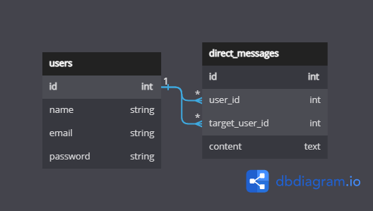
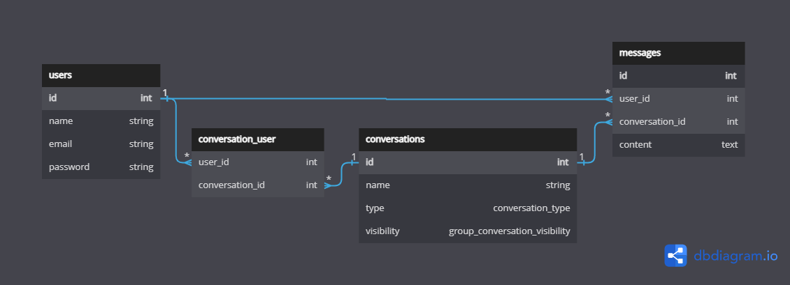

# Messenger clone


## Features

### System features

- [x] Listing contacts.
- [x] Searching for a contact.
- [x] Direct messages.
- [ ] Group messages.
- [ ] Replying to messages.
- [ ] Replying to messages in threads.
- [ ] Sending media.
- [ ]  Sending vocal messages.
- [ ] Indicating the connection status of a contact.
- [ ] Indicating when a contact was last seen if not connected.
- [ ] Signaling if user is typing.
- [ ] Reporting the message state sending - sent - delivered - seen.
- [ ] Searching for a message in a conversation.
- [ ] Editing a message, and wether to keep the history of changes or not.
- [ ] Deleting a message.

### Front end only features

- [x] Auto-scrolling down when entering a conversation.
- [ ] Showing a notification when a user isn't in the conversation.
- [ ] Showing a count of not seen messages.
- [x] Getting stored messages from the backend.
- [ ] Caching messages.
- [x] Show a separator when there is a considerable time interval between messages.

## Architecture

Like most of cloud apps. This app will need a:

-   **Database** for storing users data and messages.
-   Backend services for handling API calls, **authentication**, **session management**, **authorization** and **file management**.

In a classical way, **Laravel** with **MySQL** can handle all the above. But now the special part is enabling realtime messaging, if you are a lazy engineer and do not care about your client/employer bills its ok to pick **Firebase** to handle the messaging part. But if you have enough experience you already know that realtime data needs to be mobilized using realtime protocols such as `websocket`, and you are asking your self which websocket server implementation to couple with the chosen backend.

**Laravel** comes bundled with tools that support, **events**, **notifications**, **broadcasting**, and **queues**. But doesn't support any realtime protocol out of the box but instead of letting us stray alone looking for websocket servers to couple with **Laravel**. It eases and recommends the integration of [Pusher](https://pusher.com/) or [Ably](https://ably.com/). Even better, the community maintains packages that can be used as alternative, compatible, self hosted APIs for **Pusher**.

1. [Laravel Websockets](https://beyondco.de/docs/laravel-websockets/getting-started/introduction) is a PHP package built on top of [Ratchet](http://socketo.me/), [read more...](https://freek.dev/1228-introducing-laravel-websockets-an-easy-to-use-websocket-server-implemented-in-php).
2. [Soketi](https://soketi.app/) is a NodeJS package built on top of µWebSockets.js.

My preference is `laravel-websockets` for the simple fact of being able to maintain it in one repository with the **Laravel** backend.

For the client side `pusher-js` library is the go to, and `laravel-echo` makes it even easier to use publish and subscribe from the browsers.

To be more exhaustive, this demo will be using `sanctum` for authenticating API calls. And `axios` as a front end HTTP client.

### Scaling

<https://beyondco.de/docs/laravel-websockets/faq/scaling>

## Database

### Direct messaging only

This a basic approach. To identify conversations of user ID `1` with user ID `2` i

```sql
select *
from `direct_messages`
where
    (`user_id` = 1 and `target_user_id` = 2) or
    (`user_id` = 2 and `target_user_id` = 1)
```

[](https://dbdiagram.io/d/639cc38899cb1f3b55a1eb48)

### Group messaging support

[](https://dbdiagram.io/d/5f2bff1608c7880b65c55446)

## Scaffolding

```shell
laravel new --git messenger-clone
```

```shell
composer require laravel/sanctum
```

```shell
composer require pusher/pusher-php-server:7.0.2
```

> Version compatibilty issue <https://github.com/beyondcode/laravel-websockets/issues/1041>

```shell
composer require beyondcode/laravel-websockets:1.13.1
php artisan vendor:publish --provider="BeyondCode\LaravelWebSockets\WebSocketsServiceProvider" --tag="config"
```

```shell
npm install --save-dev laravel-echo pusher-js
```

Setup a database and the `env` configs.

## Config

The following config makes it easy to switch between **Pusher** and **Laravel Websockets**.

```env
# .env
APP_URL=http://127.0.0.1:8000

BROADCAST_DRIVER=pusher

PUSHER_APP_ID=
PUSHER_APP_KEY=
PUSHER_APP_SECRET=
PUSHER_HOST=#api-CLUSTER.pusher.com or 127.0.0.1
PUSHER_PORT=443# or any other port (recommend 6001 for Laravel Websockets)
PUSHER_SCHEME=https# or http
PUSHER_APP_CLUSTER=

LARAVEL_WEBSOCKETS_ENABLE_CLIENT_MESSAGES=true

VITE_PUSHER_APP_KEY="${PUSHER_APP_KEY}"
VITE_PUSHER_HOST="${PUSHER_HOST}"
VITE_PUSHER_PORT="${PUSHER_PORT}"
VITE_PUSHER_SCHEME="${PUSHER_SCHEME}"
VITE_PUSHER_APP_CLUSTER="${PUSHER_APP_CLUSTER}"
```

Add Sanctum's middleware `\Laravel\Sanctum\Http\Middleware\EnsureFrontendRequestsAreStateful::class` to api middleware group within `app/Http/Kernel.php`.

Register `App\Providers\BroadcastServiceProvider::class` in `config/app.php`.

```php
// config\broadcasting.php
return [
    // ...
    'connections' => [

        'pusher' => [
            'driver' => 'pusher',
            'key' => env('PUSHER_APP_KEY'),
            'secret' => env('PUSHER_APP_SECRET'),
            'app_id' => env('PUSHER_APP_ID'),
            'options' => [
                'host' => env('PUSHER_HOST', 'api-'.env('PUSHER_APP_CLUSTER', 'eu').'.pusher.com') ?: 'api-'.env('PUSHER_APP_CLUSTER', 'eu').'.pusher.com',
                'port' => env('PUSHER_PORT', 443),
                'scheme' => env('PUSHER_SCHEME', 'https'),
                'encrypted' => true,
                'useTLS' => env('PUSHER_SCHEME', 'https') === 'https',
                // Added
                'cluster' => env('PUSHER_APP_CLUSTER', 'eu'),
                'base_path' => env('PUSHER_BASE_PATH', '/apps/'.env('PUSHER_APP_ID')),
            ],
            'client_options' => [
                // Guzzle client options: https://docs.guzzlephp.org/en/stable/request-options.html
            ],
        ],
        // ...
    ]
    // ...
];
```

```php
// config\websockets.php
return [
    'dashboard' => [
        'port' => env('PUSHER_PORT', 6001),
    ],

    'apps' => [
        [
            'name' => env('APP_NAME'),
            'id' => env('PUSHER_APP_ID'),
            'key' => env('PUSHER_APP_KEY'),
            'secret' => env('PUSHER_APP_SECRET'),
            'capacity' => null,
            'enable_client_messages' => env('LARAVEL_WEBSOCKETS_ENABLE_CLIENT_MESSAGES', false),
            'enable_statistics' => true,
        ],
    ],
    // ...
];
```

```js
// resources\js\bootstrap.js
import _ from "lodash";
window._ = _;

import axios from "axios";
window.axios = axios;

import Echo from "laravel-echo";
import Pusher from "pusher-js";

window.axios.defaults.headers.common["X-Requested-With"] = "XMLHttpRequest";

axios.defaults.baseURL = import.meta.env.APP_URL;

window.axios.defaults.withCredentials = true;

window.Pusher = Pusher;

window.Echo = new Echo({
    broadcaster: import.meta.env.VITE_BROADCAST_DRIVER,
    key: import.meta.env.VITE_PUSHER_APP_KEY,
    wsHost:
        import.meta.env.VITE_PUSHER_HOST ??
        `ws-${import.meta.env.VITE_PUSHER_APP_CLUSTER}.pusher.com`,
    wsPort: import.meta.env.VITE_PUSHER_PORT ?? 80,
    wssPort: import.meta.env.VITE_PUSHER_PORT ?? 443,
    forceTLS: (import.meta.env.VITE_PUSHER_SCHEME ?? "https") === "https",
    enabledTransports: ["ws", "wss"],
    cluster: import.meta.env.VITE_PUSHER_APP_CLUSTER, // Options mentioned by pusher
    disableStats: true, // Options mentioned by beyond code
    // authEndpoint: "/custom/endpoint/auth",
    // namespace: 'App.Other.Namespace'
    authorizer: (channel, options) => {
        return {
            authorize: (socketId, callback) => {
                axios
                    .post(
                        "/broadcasting/auth",
                        {
                            socket_id: socketId,
                            channel_name: channel.name,
                        },
                        {
                            headers: {
                                Accept: "application/json",
                                Authorization:
                                    "Bearer " +
                                    localStorage.getItem("bearerToken"),
                            },
                        }
                    )
                    .then((response) => {
                        callback(false, response.data);
                    })
                    .catch((error) => {
                        callback(true, error);
                    });
            },
        };
    },
});
```

> It is essential to provide an `authorizer` callback to the config to add the `Authorization` HTTP headers (`Bearer`, cookies, ...).

```php
// routes/api.php
use Illuminate\Support\Facades\Route;

Route::post('/sanctum/token', LoginController::class);

Route::middleware('auth:sanctum')->group(function () {
    // ...
});
```

```php
// app\Providers\BroadcastServiceProvider.php
    public function boot()
    {
        Broadcast::routes(['middleware' => ['auth:sanctum']]);

        require base_path('routes/channels.php');
    }
```

```php
// routes/web.php
use Illuminate\Support\Facades\Route;

Route::fallback(fn() => view('app'));
```

### SSL

<https://beyondco.de/docs/laravel-websockets/basic-usage/ssl>

## Laravel broadcasting

### Channels

-   Events are broadcast over "channels", which may be specified as **public** or **private**.
-   Any visitor may subscribe to a **public channel** without any **authentication** or **authorization**.
-   In order to subscribe to a **private channel**, a user must be **authenticated** and **authorized** to listen on that channel.

Instances of `Channel` represent **public channels** that any user may subscribe to, while `PrivateChannels` and `PresenceChannels` represent **private channels** that require **authorization**.

### Events

#### ShouldBroadcast

Broadcastable events must implement the `Illuminate\Contracts\Broadcasting\ShouldBroadcast` interface, This will instruct Laravel to broadcast the event when it is fired.

#### broadcastOn

The `ShouldBroadcast` interface requires the event to define a `broadcastOn` method. The method return a channel or array of channels that the event should broadcast on.

```php
use Illuminate\Broadcasting\Channel;
use Illuminate\Broadcasting\PrivateChannel;
use Illuminate\Broadcasting\PresenceChannel;

public function broadcastOn(): Channel|array
{
    return [
        new Channel("name.{$this->prop}"),
        new PrivateChannel("name.{$this->prop}"),
        new PresenceChannel("name.{$this->prop}"),
    ];
}
```

#### broadcastWith

When an event is broadcast, all of its `public` properties are automatically serialized and broadcast as the event's payload.

```php
public function broadcastWith()
{
    // Get the data to broadcast.
    return [
        'id' => $this->message->id,
        'content' => $this->message->content,
        'created_at' => $this->message->created_at,
        'user_id' => $this->message->user_id,
        'target_user_id' => $this->message->target_user_id,
        'user' => [
            'id' => $this->message->user->id,
            'name' => $this->message->user->name,
        ],
    ];
}
```

#### broadcastAs

```php
public function broadcastAs()
{
    // By default: App\Events\EventFullyQualifiedClassName
    return 'CustomEventName';
}
```

#### broadcastWhen

```php
public function broadcastWhen()
{
    // Determine if this event should broadcast.
    return true;
}
```

#### Broadcast queue

By default, each broadcast event is placed on the default queue for the default queue connection specified in `config\queue.php` file [see ...](https://laravel.com/docs/9.x/broadcasting#broadcast-queue)

#### afterCommit

Dispatch event after all open database transactions have been committed.

```php
public $afterCommit = true;
```

### Authorization

When using `Echo`, the HTTP request to **authorize subscriptions** to **private channels** will be made automatically; however, you do need to define the proper routes to respond to these requests.

In `app\Providers\BroadcastServiceProvider.php`, the `Broadcast::routes` method registers the `/broadcasting/auth` route to handle authorization requests. The method will automatically place its routes within the `web` **middleware group**; however, you may pass an array of route attributes to the method if you would like to customize the assigned attributes.

Register channel authorization callbacks in `routes/channels.php`.

```php
use App\Models\User;
use Illuminate\Support\Facades\Broadcast;

// Private
Broadcast::channel(
    'name.{param}',
    fn (User $user, bool|int|string|float $param): bool => auth()->check(), // true = authorized
    ['guards' => ['web', 'admin']] // Optional custom guards
);

// Presence
Broadcast::channel(
    'chat.{roomId}',
    function ($user, $roomId) {
        if ($user->canJoinRoom($roomId)) {
            // Return user data = authorized
            return ['id' => $user->id, 'name' => $user->name];
        }
    }
);
```

All authorization callbacks receive the currently authenticated user as their first argument and any additional wildcard parameters as their subsequent arguments.

You can move the authorization logic from the callback to a class.

```shell
php artisan make:channel ChannelNameChannel
```

```php
use App\Broadcasting\OrderChannel;
use App\Channels\ChannelNameChannel;

Broadcast::channel('name.{param}', ChannelNameChannel::class);
```

### Model broadcasting

The `$event` argument can be `created`, `updated`, `deleted`, `trashed`, or `restored`.

```php
public function broadcastOn($event)
{
    return match ($event) {
        'created' => [new PrivateChannel("direct-messages.{$this->user->id}")],
        default => [$this, new PrivateChannel($this->user)],
    };
}
```

```php
public function broadcastAs($event)
{
    return match ($event) {
        'created' => 'new.message',
        default => null, // default convention: DirectMessageUpdated, DirectMessageDeleted ...
    };
}
```

```php
public function broadcastWith($event)
{
    return match ($event) {
        'created' => [/* Payload */],
        default => $this->toArray(),
    };
}
```

```php
protected function newBroadcastableEvent($event)
{
    return (new BroadcastableModelEventOccurred(
        $this, $event
    ))->dontBroadcastToCurrentUser();
}
```

```php
// Model broadcastChannel conventional name

App\Models\User::find(1)->broadcastChannel();
// "App.Models.User.1"

App\Models\DirectMessage::find(2)->broadcastChannel();
// "App.Models.DirectMessage.2"
```

### Notifications

### Dispatching

```php
use App\Events\SomeEvent;

SomeEvent::dispatch($data);

broadcast(new SomeEvent($data))->toOthers();
```

An event must use the `Illuminate\Broadcasting\InteractsWithSockets` trait in order to call the `toOthers` method.

When you initialize a `Echo`, a `socket ID` is assigned to the connection. If you are using a **global Axios instance** to make HTTP requests from your JavaScript application, `socket ID` will automatically be attached to every outgoing HTTP request as a `X-Socket-ID` header. Then, when you call `toOthers`, **Laravel** will extract `socket ID` from the header and instruct the **broadcaster** to not broadcast to any connections with that `socket ID`.

### Echo

```js
// Subscribe and register event handlers

// Public
Echo.channel(`public.${param}`)
    .listen("SomeEvent", (e) => {
        console.log(e);
    })
    .listen(/* ... */)
    .listen(/* ... */)
    .listen(/* ... */);

// Private
Echo.private(`private.${param}`)
    .listen("SomeEvent", (e) => {
        console.log(e);
    })
    .listen(/* ... */)
    .listen(/* ... */)
    .listen(/* ... */);
```

```js
// Unconventional base event namespace
Echo.channel("someChannel").listen(
    ".NotAppEventsNamespace\\Event\\Class", // Start with '.'
    (e) => {
        /* ... */
    }
);
```

```js
// Stop Listening For Events
Echo.channel(`public.${param}`).stopListening("SomeEvent");
Echo.private(`private.${param}`).stopListening("SomeEvent");
```

```js
// Presence channel
Echo.join(`chat.${roomId}`)
    .here((users) => {
        // executed immediately once the channel is joined successfully
    })
    .joining((user) => {
        // executed when a new user joins
        console.log(user.name);
    })
    .leaving((user) => {
        // executed when a user leaves the channel
        console.log(user.name);
    })
    .error((error) => {
        // executed when the authentication endpoint returns a HTTP status code other than 200
        // or if there is a problem parsing the returned JSON
        console.error(error);
    })
    .listen(/* ... */)
    .listen(/* ... */)
    .listen(/* ... */);
```

```js
Echo.private(`App.Models.User.${userId}`).listen(".PostUpdated", (e) => {
    console.log(e.model);
});
```

```js
// client events

// Send
Echo.private(`chat.${roomId}`).whisper("typing", {
    name: this.user.name,
});

// Listen
Echo.private(`chat.${roomId}`).listenForWhisper("typing", (e) => {
    console.log(e.name);
});
```

```js
// Notifications
Echo.private(`App.Models.User.${userId}`).notification((notification) => {
    console.log(notification.type);
});
```

#### Socket ID

If you are not using a **global Axios instance**, you will need to manually configure your JavaScript application to send the `X-Socket-ID` header with all outgoing requests. You may retrieve the `socket ID` using:

```js
let socketId = Echo.socketId();
```

## References

### Laravel docs refs

-   <https://laravel.com/docs/9.x/queues>
-   <https://laravel.com/docs/9.x/events>
-   <https://laravel.com/docs/9.x/notifications>
-   <https://laravel.com/docs/9.x/broadcasting>
-   <https://laravel.com/docs/9.x/sanctum>

### Database Design refs

-   <https://www.youtube.com/watch?v=xL_tYrEcP9M>
-   <https://towardsdatascience.com/ace-the-system-interview-design-a-chat-application-3f34fd5b85d0>
-   <https://stackoverflow.com/questions/46484989/database-schema-for-chat-private-and-group>
-   <https://stackoverflow.com/questions/39810106/storing-messages-of-different-chats-in-a-single-database-table>

### Architecture refs

-   <https://devtechnosys.com/messaging-app-development.php>
-   <https://www.youtube.com/watch?v=vvhC64hQZMk>

### Laravel Webcockets refs

-   <https://beyondco.de/docs/laravel-websockets/getting-started/introduction>
-   <https://www.youtube.com/watch?v=xKru8j9LXjA>
-   <https://www.youtube.com/watch?v=pd8LmGxt5Og&list=PLSfH3ojgWsQosqpQUc28yP9jJZXrEylJY&index=47> \[45-52\]
-   <https://www.youtube.com/watch?v=UwB5z6u7vt8>
