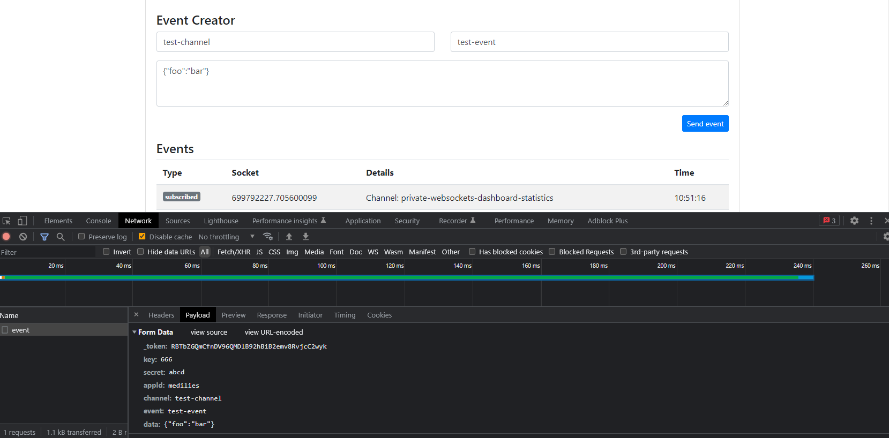

# Traying beyondcode/laravel-websockets on Laravel 9

Setup a database and run

```bash
php artisan migrate
```

Set `PUSHER_APP_ID`, `PUSHER_APP_KEY`, and `PUSHER_APP_SECRET` in `.env` file.

Run the WS server

```bash
php ./artisan websockets:serve
```

Run the HTTP server

```bash
php ./artisan serve
```

Visit `http://127.0.0.1:8000/laravel-websockets`

You can test a WS communication by filling the **Event Creator** form:

-   `Channel`: any string.
-   `Event`: any string.
-   `Data`: a JSON string.

For example:



## Keynotes from docs

> Before diving into event broadcasting, make sure you have read Laravel's documentation on events and listeners.

> Event broadcasting is accomplished by a server-side broadcasting driver that broadcasts your Laravel events so that Laravel Echo (a JavaScript library) can receive them within the browser client.

> All of your application's event broadcasting configuration is stored in the `config/broadcasting.php` configuration file.

> Before broadcasting any events, you will first need to register the `App\Providers\BroadcastServiceProvider`.

> You will need to configure and run a queue worker. All event broadcasting is done via queued jobs.

> If you plan to broadcast your events using Pusher Channels, you should install the Pusher Channels PHP SDK.

```bash
composer require pusher/pusher-php-server
```

```env
PUSHER_APP_ID=your-pusher-app-id
PUSHER_APP_KEY=your-pusher-key
PUSHER_APP_SECRET=your-pusher-secret
PUSHER_APP_CLUSTER=mt1

BROADCAST_DRIVER=pusher
```

> The laravel-websockets and soketi packages provide Pusher compatible WebSocket servers for Laravel.

> Laravel Echo is a JavaScript library that makes it painless to subscribe to channels and listen for events broadcast by your server-side broadcasting driver.

```bash
npm install --save-dev laravel-echo pusher-js
```
